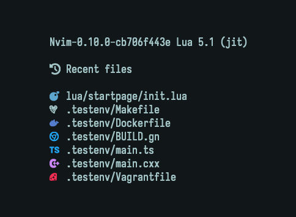

<h1 align="center">startpage.nvim</h1>
<p align="center">
  
</p>

Simple startpage for Neovim. If you want something that is highly customizable,
use something else, e.g. [dashboard-nvim](https://github.com/nvimdev/dashboard-nvim).
The startpage provides shortcuts to `oldfiles` with icons loaded from
[nvim-web-devicons](https://github.com/nvim-tree/nvim-web-devicons).

```lua
require 'startpage'.setup{
    recent_files_header = "  Recent files",
    oldfiles_count = 7
}
```


